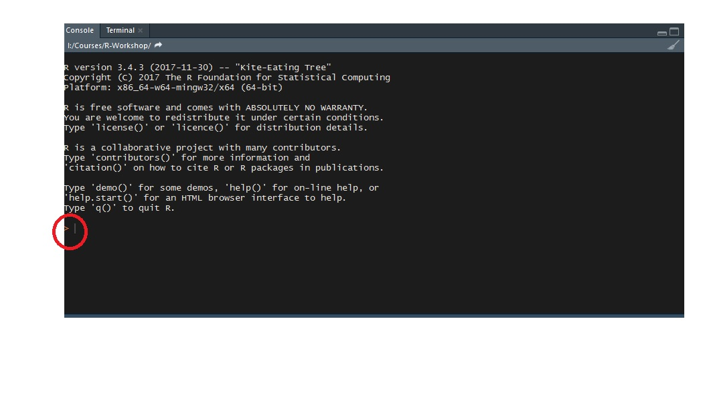
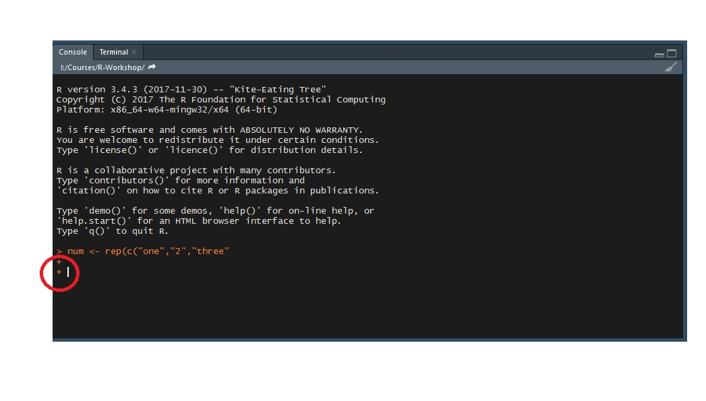
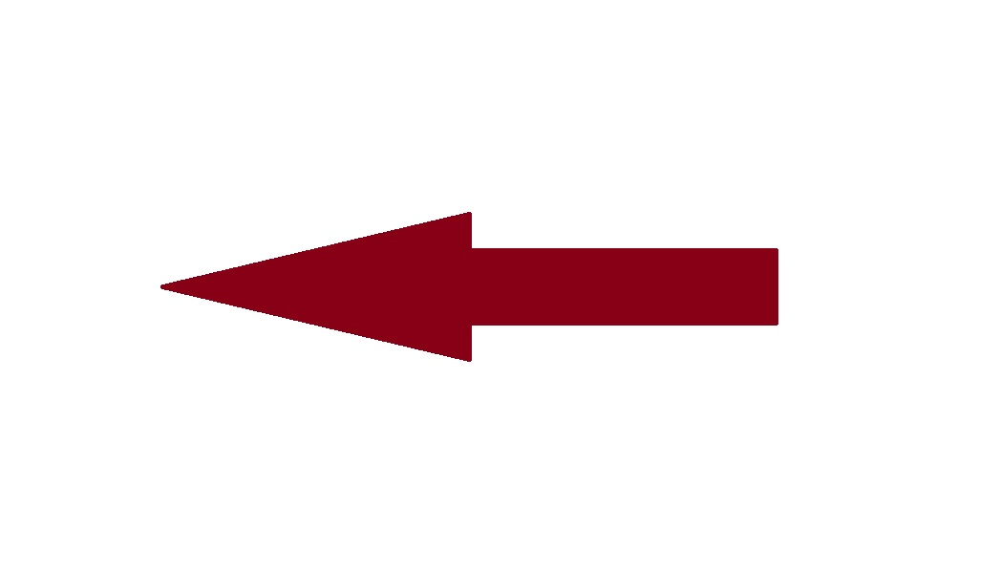
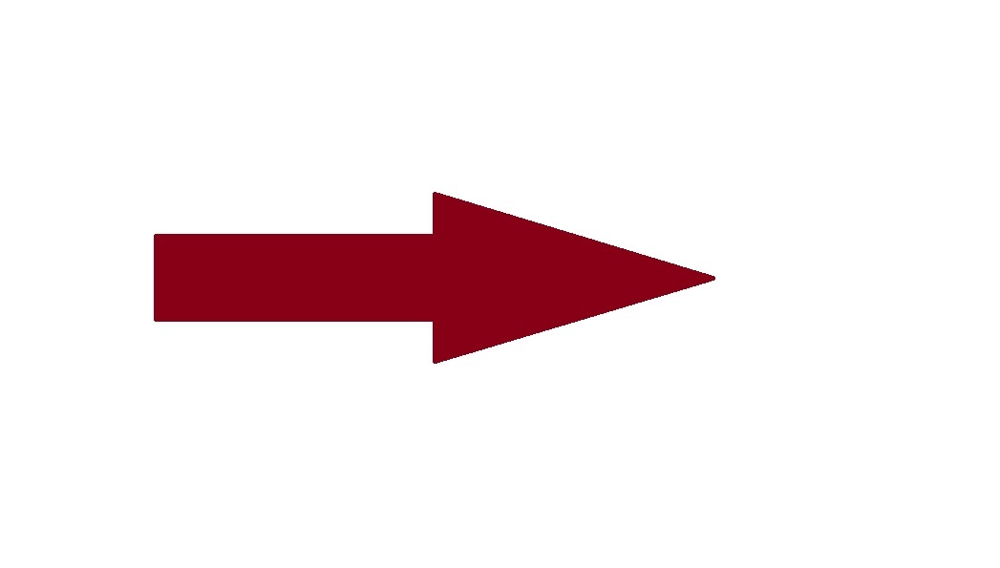
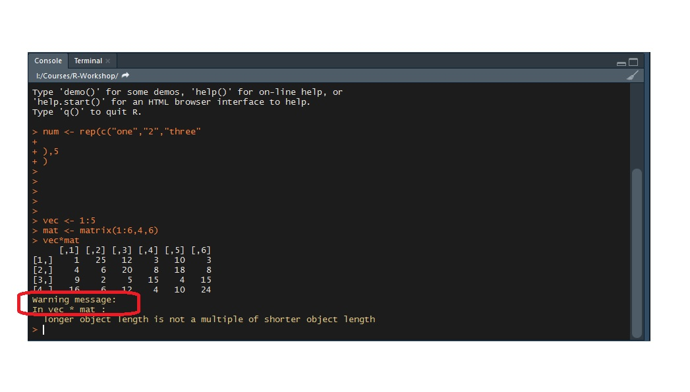
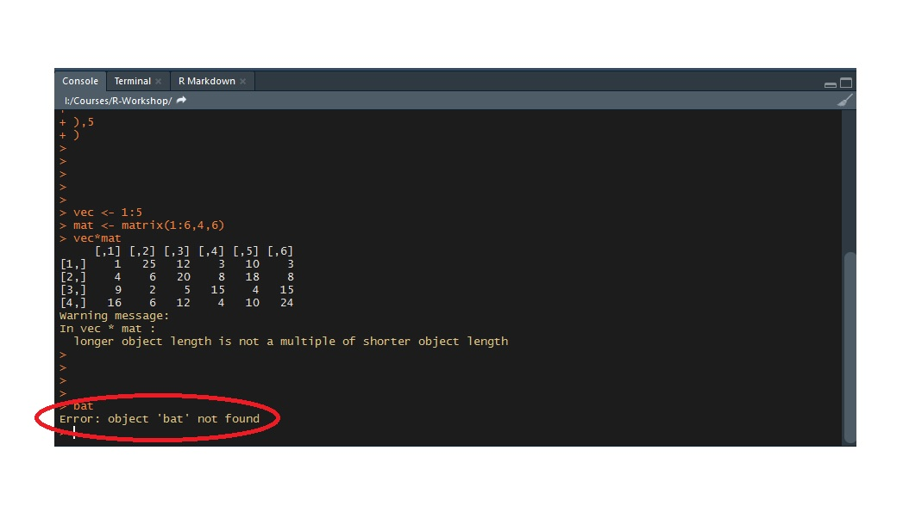

  
  
## Symbols

Identify the symbols in the image and what they mean.

##  

##

## What goes on the left? What goes on the right?

##What goes on the left? What goes on the right?

##  

##  

