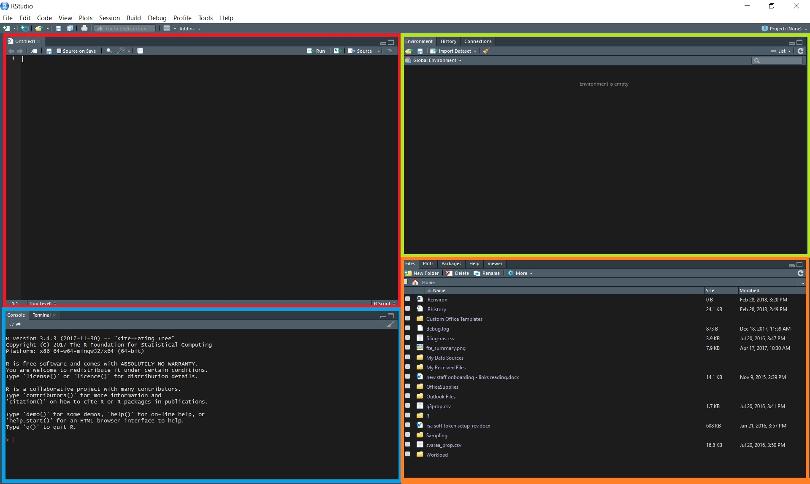

```{r setup, include=FALSE}
knitr::opts_chunk$set(echo = FALSE)
```

## Purpose of Workshop

- Provide overview of basic concepts of R, how to integrate this into current workflow, as well as, tips on debugging.

- There will be references to Excel and Stata.

- This is not a course on statistics or data analysis.

- If interested in the latter, sign up for:

+ Noah Lehman's course, 
+ Tomas Aragon's book  (<https://bookdown.org/medepi/phds/>),
+ or read Hadly Wikham's book (<http://r4ds.had.co.nz/>).


## What is R?

A free software that enables statistical computation, data analysis, and graphs. Built on this core are tools that allows users to integrate it with reports and interactive dashboarding on various platforms.


<div align="center">

</div>

## What is RStudio?

A powerful integrated development environment (IDE) for R. It facilitate coding, compling, debugging, and deploying. 

<!---


-->

<div align="center">

</div>

## Basic Calculation

What is 3*3? 

- Excel
- Stata
- R

## How do you print "Coding Rocks!"? 

- Excel
- Stata
- R

## R Objects

An object is a way of referencing data stored in the computer memory based on its data structure. Understanding the structure of data element is important as there are rules around what can and cannot be done with certain structure.


- Assign 3 to an object called "a"

    ```{r singN,, echo=TRUE}
a <- 3
```

- Call the object "a"

    ```{r signa, echo= TRUE}
a
```

- What is a*3?

## Is there an equivalent in Excel or Stata?


## What is the structure of a?
(What is the formatting of the information saved in the object?)

- Excel
- Stata

## Data Mode in R

```{r modeN, echo=TRUE}
mode(3)

mode(a)
```


* Note: calling and using a function requires "()"


    ```{r strN, echo=TRUE}
str(3)
str(a)
```

## "Coding Rocks!"

- what is the mode?
- save it to an object

## Naming Conventions

1. R is case sensitive
2. Can be letters and numbers, BUT must start with a letter
3. accepts "_" and "." in object name
4. names should be descriptive 

## Multiple elements in a vector object

- Create the object

    ```{r vec, echo=TRUE}
num <- rep(c("one","2","three"), times = 5)

```

- How many function was used to create "num"?
- What is the mode of "num"?
- How would you change the mode of "num" in 
    + Excel? 
    + Stata? 
    + R?

## Change the mode of an object

- What is a factor?

- Convert "num" into a factor

- solution

    ```{r factor, echo=TRUE}
factor(num)
num_fac <- factor(num)    
num_fac <- as.factor(num)

```

## Concepts covered
1. Overview of R and RStudio
2. Data objects (essentials...more to be covered)
3. Transform data object
3. Functions