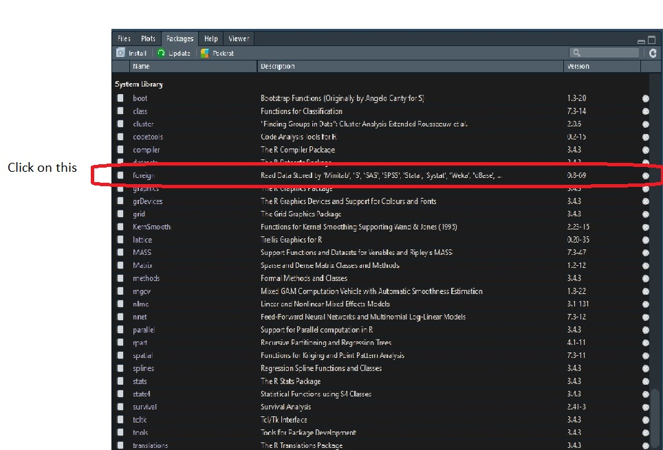

## Review Objects

- Atomic
- Vector
- Matrix
- Array
- List


# Visualize Objects


##  Atomic as a dot/coin


##  Vector as a line/bar


##  Matrix as a square/paper


##  Array as a cube/box


##  List as a container/chest


## Indexing


```{r index, echo=TRUE}
mat <- matrix(1:24,4,6)
arr <- array(1:40, dim = c(4,5,2))

mat[3,4]
```

- What is the index for arr containing the value 36?
- arr[4,4,2]

## Working with List

- Load list of Homework 1 objects into environment

- What does it look like?

```{r list, echo=FALSE, include=FALSE}
# Run exercise_sol.Rmd file for Homework 1 and save the object in the datafile
# obj <- ls()
# hw1_dat <- lapply(obj, function(x) get(x))
# names(hw1_dat) <- obj
# 
# saveRDS(hw1_dat,"../data/hw1_dat.rds")
```

```{r list_read, echo=FALSE, include=TRUE}
hw1_dat <- readRDS("../data/hw1_dat.rds")

```

    ```{r list_str, echo=TRUE}
str(hw1_dat)

```

    ```{r list_obj, echo=TRUE}
hw1_dat

```

## Extract Objects from list

- Get the first object in hw1_dat

    ```{r list_bin1, echo=TRUE}
hw1_dat[1]
hw1_dat[[1]]
hw1_dat$mat

```

## Extract elements from object in list

- Get the element in the 2nd row and 3rd column from the first object in hw1_dat

    ```{r list_binElement, echo=TRUE}
hw1_dat$mat[2,3]
hw1_dat[[1]][2,3]
    
```

# Library


## Library packages

- What is include in the base package?

    ```{r base, echo=TRUE}

library(help = "base")

```

## Other Library packages

- Packages contains funtions and data not included in the base package

- Programers develop packages for specific fields or simplifying their coding process

- Beware that a function in one package can mask a function in another package

    ```{r libraries, echo=TRUE}
library(dplyr)

```

## Tidyverse

What is tidyverse?

```{r tidyverse, echo=TRUE}
library(tidyverse)

```

- Collection of packages for data analysis and visualization where the packages share similar structure, concepts, and coding logic.


## Special Library Loading

- Call a specific function from a package for a specific code
- Use the format
    + package::function()
    + e.g., dplyr::filter() 


# Getting Data Into and Out of R

## Import Files

- What type of data files do we normally work with?
    + Excel
    + Stata
    
- Libraries for Excel
    + library(utils)*
    + library(readr)
    + library(readxl)
    + library(openxlsx)

    *Do not need to load this package.
    
- Libraries for Stata
    + library(foreign)
    + library(readstata13)

- Other packages exist to read other data format    


## What functions are available in the foreign package?



## File Pathways

- Change the working directory
    + getwd() identify the current working directory
    + setwd() changes the working directory pathway
    + NOTE: R  use the forward slash ("/") not the backward slash ("\\") for file pathway
    +   The "\\" is used to escape R special character
    
- Use the full pathway for the data file
    + file.choose() is a shortcut to generating the full file path
    + shortened pathway can be used if within subworking directory
    + file name only if in the same working directory
    + html pathway if online
    

## Read file examples

- Read in the "drinks" data file

- Example: csv file within subworking directory

    ```{r readin, echo=TRUE}

drinks <- read.csv("../data/drinks.csv", header = TRUE)

```

- Example: excel file within subworking directory

    ```{r readinexcel, echo=TRUE}
library(readxl)
drinks <- read_excel("../data/drinks_USbirths.xlsx", sheet = "drinks")
```

## Export Files

- Example: stata file in different directory

    ```{r, writeSTATA, echo = TRUE}
library(foreign)
write.dta(drinks,"C:/Users/SHong/Desktop/drinks.dta")
```

- 
    + specify the R object to be exported
    + specify the file format in the name of the file pathway

## Concepts covered
1. Conceptual framework of data objects
2. Indexing
3. Library packages
4. Read (import) in data
5. Write (export) out data

## Exercises : Coder

- Read in the data file:
    + drinks, or
    + US Births
    
- Describe the data
    + Some commands to consider.... str, summary, colnames, rownames, length
    + commands you've learned in other courses

- Export the data
    + in any file format of your choice
    + must be in a different directory or subdirectory
    
## Exercises : Reviewer

- Run the code given to you
    + What did you learn from the other person's code?
    + Were you able to perfom any troubleshooting?
    + What challenges did you experience in reading/running the other person's code?
    
## Exercises : Bonus

- Rerun your code for Homework 1
- Save objects in your environment as a list
