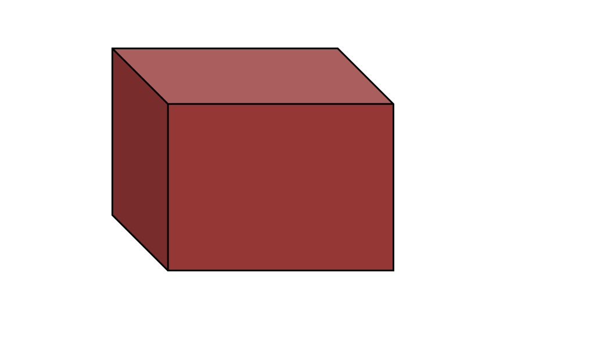

## Review Objects

- Scalar
- Vector
- Matrix
-Array
- List

## Visualize Objects


##  Scalar as a dot/coin


##  Vector as a line/bar


##  Matrix as a square/paper


##  Array as a cube/box


##  List as a container/chest


## Indexing


```{r index, echo=TRUE}
vec <- 1:5
mat <- matrix(1:6,4,6)

vec[5]
```

- Index the value for the element in the 3rd row and 4th column of mat.


## Libraries

## Import Files

## Export Files