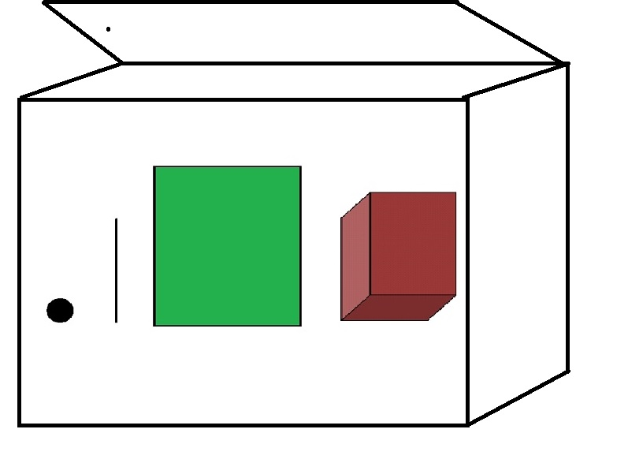

## Review Objects

- Scalar
- Vector
- Matrix
- Array
- List


# Visualize Objects


##  Scalar as a dot/coin


##  Vector as a line/bar


##  Matrix as a square/paper


##  Array as a cube/box


##  List as a container/chest


## Indexing


```{r index, echo=TRUE}
mat <- matrix(1:6,4,6)
arr <- array(1:40, dim = c(4,5,2))

mat[3,4]
```

- What is the index for arr containing the value 36?
- arr[4,4,2]

# Library


## Library packages

```{r base, include=FALSE}

library(help = "base")

```

- Packages contains funtions and data not included in the base package

- Programers develop packages for specific disciplines or simplifying their coding process

- Beware that a function in one package can mask a function in another package

    ```{r libraries, echo=TRUE}
library(dplyr)

```

## Tidyverse

What is tidyverse?

```{r tidyverse, echo=TRUE}
library(tidyverse)

```

- Collection of packages for data analysis and visualization where the packages share similar structure, concepts, and coding logic.

# Getting Data Into and Out of R

## Import Files

- What type of data files do we normally work with?
    + Excel
    + Stata
    
- Libraries for Excel
    + library(utils)*
    + library(readr)
    + library(readxl)
    + library(openxlsx)

    *Do not need to load this package.
    
- Libraries for Stata
    + library(foreign)
    + library(readstata13)

- Other packages exist to read other data format    


## What functions are available in the foreign package?


## File Pathways

- Change the working directory
    + getwd() identify the current working directory
    + setwd() changes the working directory pathway
    
- Use the full pathway for the data file
    + file.choose() is a shortcut to generating the full file path
    + shortened pathway can be used if within subworking directory
    + file name only if in the same working directory
    + html pathway if online
    

## Read file examples

- Read in the "drinks" data file

- Example: csv file within subworking directory

    ```{r readin, echo=TRUE}

drinks <- read.csv("../data/drinks.csv", header = TRUE)

```

- Example: excel file within subworking directory

    ```{r readinexcel, echo=TRUE}
library(readxl)
drinks <- read_excel("../data/drinks_USbirths.xlsx", sheet = "drinks")
```

## Export Files

- Example: stata file in different directory

    ```{r, writeSTATA, echo = TRUE}
library(foreign)
write.dta(drinks,"C:/Users/SHong/Desktop/drinks.dta")
```

- 
    + specify the R object to be exported
    + specify the file format that in export

## Concepts covered
1. Conceptual framework of data objects
2. Indexing
3. Library packages
4. Read (import) in data
5. Write (export) out data

## Exercises

- Read in the data file:
    + drinks, or
    + US Births
    
- Describe the data
    + Some commands to consider.... str, summary, colnames, rownames, length

- Export the data
    + in any file format of your choice
    + must be in a different subdirectory or directory
