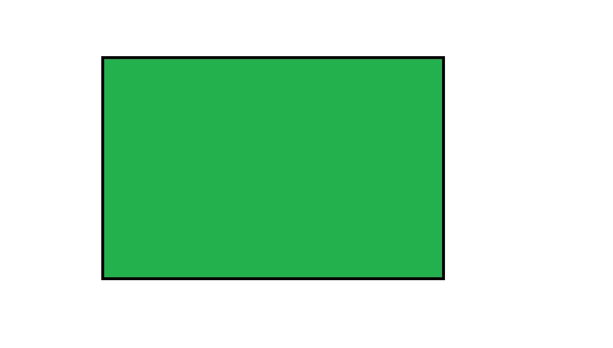

## Review Objects

- Scalar
- Vector
- Matrix
- Array
- List


# Visualize Objects


##  Scalar as a dot/coin


##  Vector as a line/bar


##  Matrix as a square/paper


##  Array as a cube/box


##  List as a container/chest


## Indexing


```{r index, echo=TRUE}
mat <- matrix(1:6,4,6)
arr <- array(1:40, dim = c(4,5,2))

mat[3,4]
```

- What is the index for arr containing the value 36?
- arr[4,4,2]

# Library


## Library packages

```{r base, include=FALSE}

library(help = "base")

```

- Packages contains funtions and data not included in the base package

- Programers develop packages for specific disciplines or simplifying their coding process

- Beware that a function in one package can mask a function in another package

    ```{r libraries, echo=TRUE}
library(dplyr)

```

## Tidyverse

What is tidyverse?

```{r tidyverse, echo=TRUE}
library(tidyverse)

```

- Collection of packages for data analysis and visualization where the packages share similar structure, concepts, and coding logic.

## Import Files

- What type of data files do we normally work with?
    + Excel
    + Stata
    
- Libraries for Excel
    + library(utils)*
    + library(readr)
    + library(readxl)
    + library(openxlsx)

    *Do not need to load this package.
    
- Libraries for Stata
    + library(foreign)
    + library(readstata13)

- Other packages exist to read other data format    


## What functions are available in the foreign package?


## File Pathways

- Use the full pathway for the data file
    + file.choose() is a shortcut to generating the file path

- Change the working directory
    + getwd() identify the current working directory
    + setwd() changes the working directory pathway


## Read file examples

```{r readin, echo=TRUE}

drinks <- read.csv("../data/drinks.csv", header = TRUE)

```

## Export Files


## Concepts covered
1. Conceptual framework of data objects
2. Indexing
3. Library packages
4. Read (import) in data
5. Write (export) out data

## Exercises

- Read in the OBJ.RDS data file
    + Extract the first object in the list and save it to an object
    + Extract the second object in the list and save it to a different object
    + What are now the different types of data objects that exist in your Evironment?

- Imagine the first object came from one data source and the second data object came from a second data source, how would you go about validating the data?
    + Did the two data source collect the same information?
    + Are there any discrepancies?
    
- If the first data source is considered the most valid data, modify and update the second data source if any discrepancies exist.    

