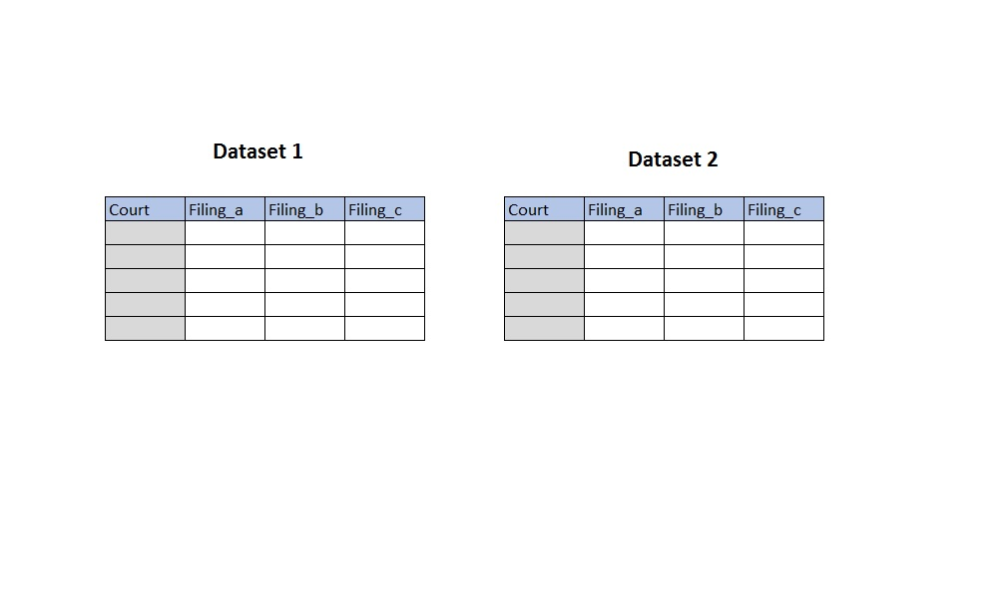
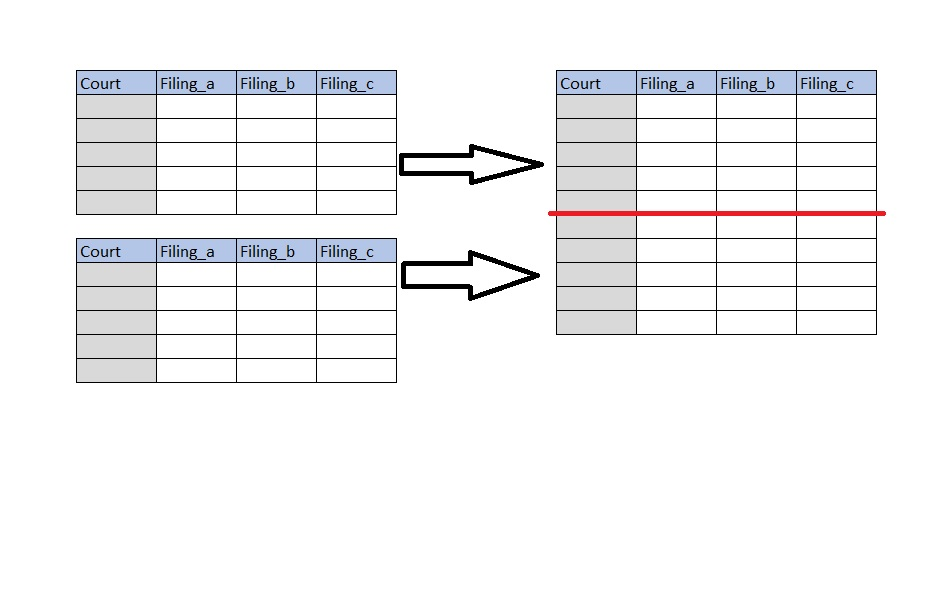
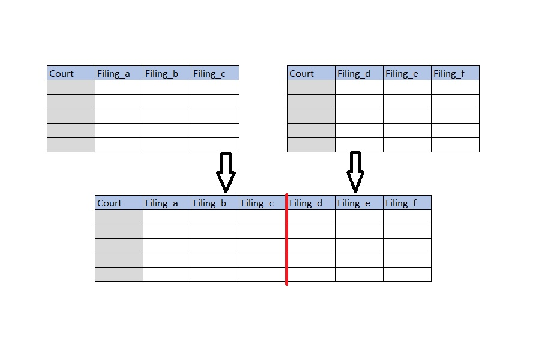
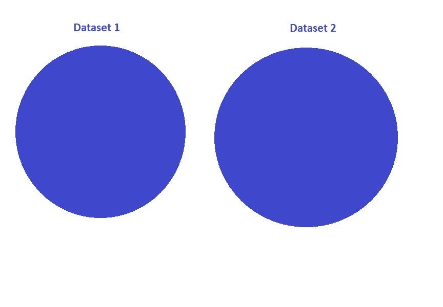
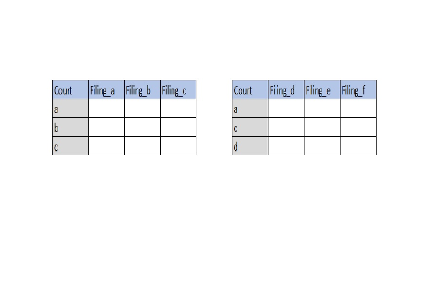
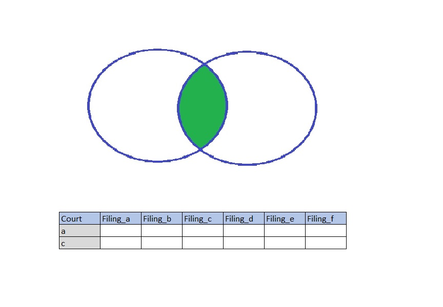
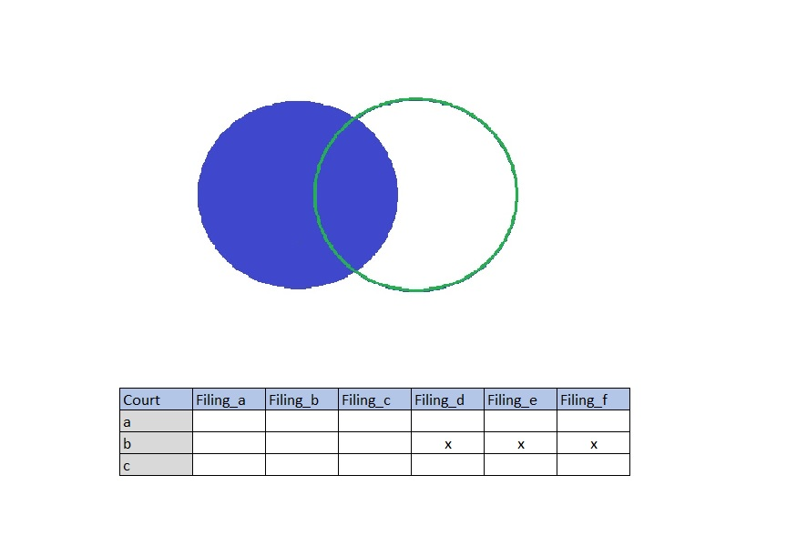
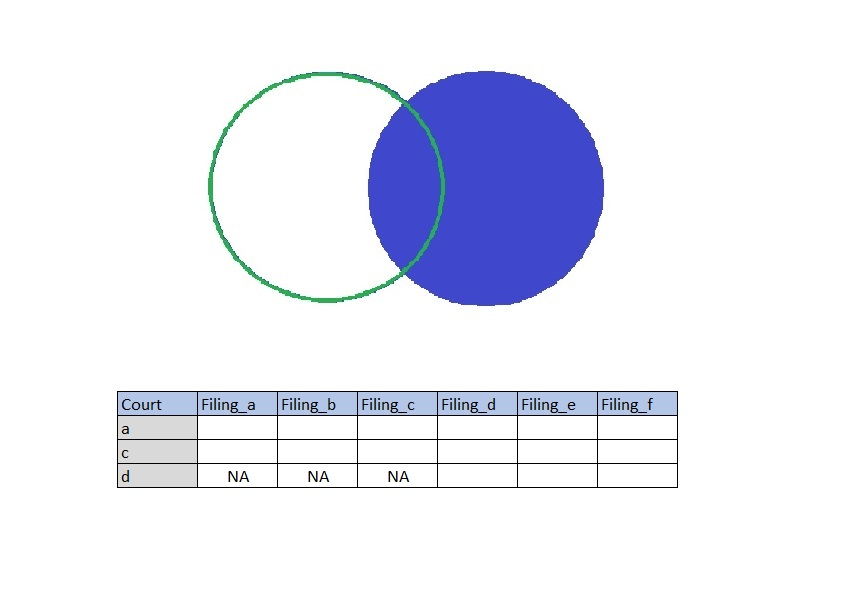
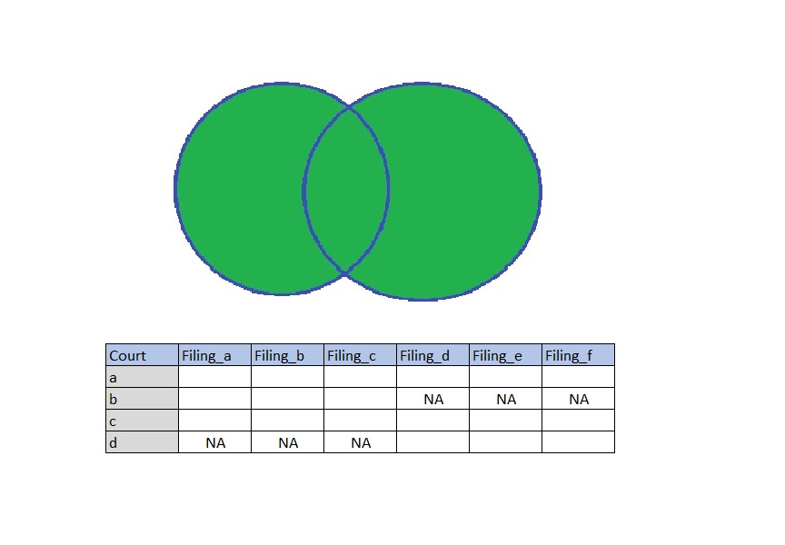

## Combining Datasets 



## Combining Datasets

- What are the two major concepts in Stata when putting together two datasets together?
    + Append
    + Merge
    
```{r, include=FALSE}
library(readxl)
library(tidyverse)    

courtb_p1 <- read_excel("../data/MockData.xlsx", sheet = "CourtB-Filing", range = "A1:G13")
courtb_p2 <- read_excel("../data/MockData.xlsx", sheet = "CourtB-Filing", range = "A16:G28")

```


## What is this form of "combining" called? 




## What are some commands that allows appending in R?

- rbind()
- rbind.data.frame()
- merge()


## Example

- 
    ```{r append, echo=TRUE, eval=FALSE}
library(readxl)
library(tidyverse)    

courtb_p1 <- read_excel("../data/MockData.xlsx", sheet = "CourtB-Filing", range = "A1:G13")
courtc_p1 <- read_excel("../data/MockData.xlsx", sheet = "CourtC-Filing", range = "A1:G12")
    
court_rbind <- rbind(courtb_p1, courtc_p1)
court_rbind

court_merge <- merge(courtb_p1, courtc_p1)
court_merge

court_merge <- merge(courtb_p1, courtc_p1, all = TRUE)
court_merge

```

- What do you observe?
    + Ordering of columns
    + Number of rows (observations)
    + Ordering of Rows


## What is this form of "combining" called?




## Understanding Merge




## {.centered}


## Everything that **matches** Dataset 1 & 2  




## Everything from Dataset 1 


## Everything from Dataset 2 



## Everything from Dataset 1 & 2 


  

## What are some commands that allows merging in R?
- Base function
    + cbind()
    + cbind.data.frame()
    + merge()
    + merge.data.frame()
    
- Dplyr function
    + left_join()
    + right_join()
    + inner_join()
    + full_join()    


## Example

```{r cbind, echo=TRUE, eval=FALSE}
courtb_p1 <- read_excel("../data/MockData.xlsx", sheet = "CourtB-Filing", range = "A1:G13")
courtb_p2 <- read_excel("../data/MockData.xlsx", sheet = "CourtB-Filing", range = "A16:G28")
    
courtb_cbind <- cbind(courtb_p1, courtb_p2)
courtb_cbind
```

- What do you observe?
    + Duplicate variable(s)
    + Ordering of Rows

## 

- 
    ```{r, echo=TRUE, eval=FALSE}
courtb <- merge(courtb_p1, courtb_p2)
courtb <- merge.data.frame(courtb_p1, courtb_p2)

View(courtb)

```

- What do you observe?
    + Duplicate variable(s)
    + Ordering of Rows


## Try these functions

```{r, echo=TRUE, eval=FALSE}
court_c_b <- merge(courtc_p1, courtb_p2)

merge(courtc_p1, courtb_p2, all.x = TRUE)
left_join(courtc_p1, courtb_p2)

merge(courtc_p1, courtb_p2, all.y = TRUE)
right_join(courtc_p1, courtb_p2)

merge(courtc_p1, courtb_p2, all.x = TRUE, all.y = TRUE)
full_join(courtc_p1, courtb_p2)


```    


## Reference

- Data Wrangling Cheat Sheet (Dplyr and Tidyr)   
https://www.rstudio.com/wp-content/uploads/2015/02/data-wrangling-cheatsheet.pdf

- Cheatsheet with Examples  
http://stat545.com/bit001_dplyr-cheatsheet.html


## Concepts Covered
- Appending data files
- Merge 
    + inner
    + left 
    + right
    + full
- Merge functions built in 
    + base package
    + dplyr
