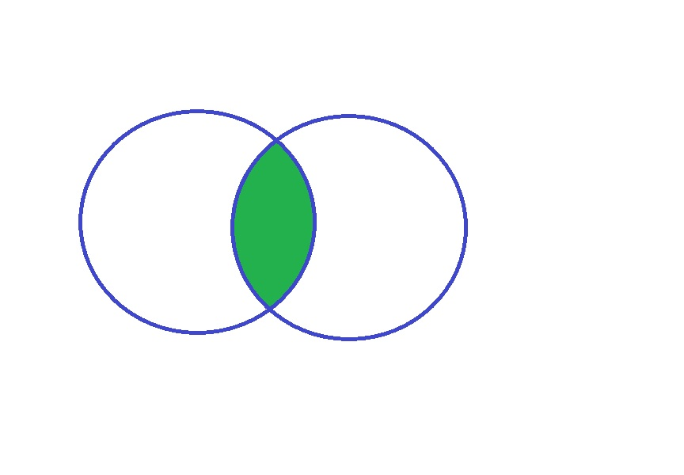

## Combining Datasets


## Combining Datasets

- What are the two major concepts in Stata when putting together two datasets together?
    + Append
    + Merge
    
```{r, include=FALSE}
library(readxl)
library(tidyverse)    

courtb_p1 <- read_excel("../data/MockData.xlsx", sheet = "CourtB-Filing", range = "A1:G13")
courtb_p2 <- read_excel("../data/MockData.xlsx", sheet = "CourtB-Filing", range = "A16:G28")

```


## What is this form of "combining" called?


## What are some commands that allows appending in R?

- c()
- rbind()
- rbind.data.frame()
- merge()


## Example

- 
    ```{r append, echo=TRUE, eval=FALSE}
library(readxl)
library(tidyverse)    

courtb_p1 <- read_excel("../data/MockData.xlsx", sheet = "CourtB-Filing", range = "A1:G13")
courtb_p2 <- read_excel("../data/MockData.xlsx", sheet = "CourtB-Filing", range = "A16:G28")
    
courtb_cbind <- cbind(courtb_p1, courtb_p2)
courtb_cbind
```

- What do you observe?
    + Duplicate variable(s)
    + Ordering of Rows


## What is this form of "combining" called?


## What are some commands that allows merging in R?
- Base function
    + cbind()
    + cbind.data.frame()
    + merge()
    + merge.data.frame()


## Example
- 
    ```{r cbind, echo=TRUE, eval=FALSE}
courtb_p1 <- read_excel("../data/MockData.xlsx", sheet = "CourtB-Filing", range = "A1:G13")
courtb_p2 <- read_excel("../data/MockData.xlsx", sheet = "CourtB-Filing", range = "A16:G28")
    
courtb_cbind <- cbind(courtb_p1, courtb_p2)
courtb_cbind
```

- What do you observe?
    + Duplicate variable(s)
    + Ordering of Rows


    ```{r, echo=TRUE, eval=FALSE}
View(courtb_p1)
View(courtb_p2)

courtb <- merge(courtb_p1, courtb_p2)
courtb <- merge.data.frame(courtb_p1, courtb_p2)
```

- What do you observe?
    + Duplicate variable(s)
    + Ordering of Rows


## Understanding Merge


## Everything from Dataset 1


## Everything from Dataset 2


## Everything that **matches** Dataset 1 & 2



## Everything from Dataset 1 & 2


  


## Takes rows by the specified column and puts them together...


- Dplyr function
    ```{r, echo=TRUE, eval=FALSE}
    
```    


## Reference

- Data Wrangling Cheat Sheet (Dplyr and Tidyr)
https://www.rstudio.com/wp-content/uploads/2015/02/data-wrangling-cheatsheet.pdf

- Cheatsheet with Examples
http://stat545.com/bit001_dplyr-cheatsheet.html


## Concepts to be Merged
- Wide
- Long
